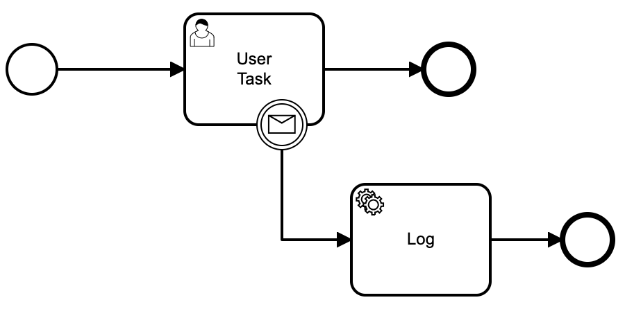

Allows BPMN designers to declaratively define what values, from an incoming JSON based message, will be used to correlate to a Process or a Process Instance (e.g. Execution).  Message values are evaluated at runtime using JSON Path expressions which are stored within the BPMN.

The following Message Events are supported:
=====
#### Start events

#### Intermediate Catch Events

####Interrupting & Non-interrupting Boundary Catch Events

The following extension semantics are currently supported
====== 
##### {prefix}.business-process-key={json-path}
Note: can also be declared as {prefix}.match-var.business-process-key={json-path}
Assigns the business process key that will be used to start a new process or match on a currently running process
##### {prefix}.match-var.{variable-name}={json-path}
Creates a match requirement on a variable whose name is defined by {variable-name}
##### {prefix}.input-var.{variable-name}={json-path}
Sets a variable, whose name is defined by {variable-name}
